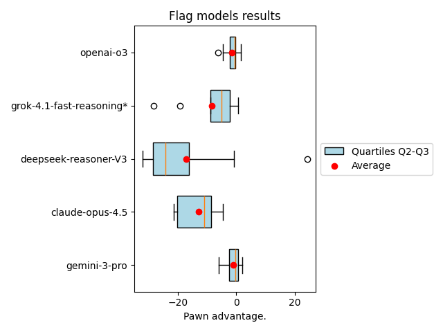
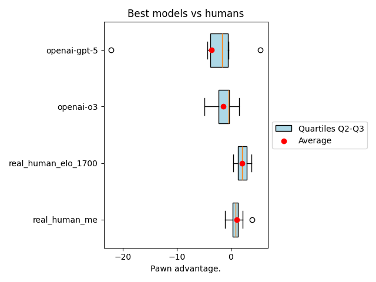

# LLM Reasoning Benchmark through Chess

This project is a benchmark designed to test the reasoning abilities of large language models (LLMs) using chess tasks.

---

## Why Chess?

Large language models such as **claude-opus-4.5** or **chat-gpt-5** still face significant challenges when playing chess. After the opening phase, which relies on known patterns, these models often make obvious mistakes—losing pieces without compensation or making illegal moves.

Chess is a particularly good test because:

- **Explainability**: The position on the board can be easily and objectively evaluated by a chess engine. Furthermore, it is not difficult to find a chess player who will analyze the games and spot mistakes and missed opportunities.
- **Demanding Tasks**: The benchmark is demanding and poses a real challenge for LLMs.

---

## How Does the Benchmark Work?

- The LLM plays a game against the weak **Stockfish engine**.
- When party is ended every move is evaluated.
- Moves in debut are discarded.
- The LLM score is calculated as the average of all positions scores.
- More about it in [methodology](docs/methodology.md)

## Flag models results

\*Grok 4 was unable to make answers before timeout.

Gemini 3-pro is currently the best. OpenAI o3 model - is also decent opponent.
ChatGPT 5 is usable, but newer versions 5.2 not add much improvement, and is disproportionately expensive.

Very good score in one party of deepseek reasoner is probably result of very poor move made by engine. Engine analysis depth is really shallow, what sometimes result in fatally bad moves.

## All results

| Model                                         | Games number |   Mean | Median |    Min |    Max | Cost per game ($) |
|:----------------------------------------------|-------------:|-------:|-------:|-------:|-------:|:------------------|
| real_human_elo_1700                           |            2 |   2.16 |   2.16 |   0.49 |   3.82 | -                 |
| real_human_me                                 |            8 |   1.09 |   0.93 |  -1.01 |   4.04 | -                 |
| gemini-gemini-3-pro                           |            8 |  -1.04 |  -0.33 |  -5.94 |   1.98 | 1.23              |
| openai-o3                                     |            8 |  -1.46 |  -0.44 |  -5.91 |   1.63 | 1.32              |
| openai-gpt-5.2-pro                            |            2 |  -1.53 |  -1.53 |  -1.84 |  -1.22 | 5.54              |
| openai-gpt-5                                  |            8 |  -3.59 |  -1.59 | -22.11 |   5.42 | 1.48              |
| openai-o4-mini                                |            8 |  -7.74 |  -5.00 | -19.22 |  -0.72 | 0.80              |
| xai-grok-4-1-fast-reasoning                   |            8 |  -8.29 |  -5.10 | -28.11 |   0.66 | 0.14              |
| anthropic-claude-opus-4-5-20251101            |            8 | -12.93 | -11.04 | -21.27 |  -4.58 | 0.19              |
| anthropic-claude-opus-4-1-20250805            |            8 | -14.89 | -14.67 | -29.47 |  -4.89 | 1.11              |
| anthropic-claude-sonnet-4-20250514            |            8 | -21.01 | -20.03 | -29.67 | -10.87 | 0.47              |
| deepseek-deepseek-reasoner-V3                 |            8 | -16.98 | -24.16 |  -32.0 |  24.36 | 0.18              |
| gemini-gemini-2.5-pro                         |            8 | -24.19 | -25.52 |  -32.0 | -11.53 | 0.20              |
| xai-grok-code-fast-1                          |            8 | -27.63 | -30.19 |  -32.0 | -17.24 | 0.07              |
| meta-llama-4-maverick-17b-128e                |            8 | -30.23 | -30.69 | -32.00 | -25.46 | -                 |
| gemini-gemini-2.5-flash                       |            8 | -30.56 | -31.35 |  -32.0 | -28.03 | 0.05              |
| llama-3.3-70b                                 |            8 | -29.96 | -32.00 | -32.00 | -22.74 | -                 |

All results, with parties record are available under:
https://drive.google.com/drive/folders/1a3sqEMmo99rRIoFuM6GCEfgdtU7WkDsl?usp=drive_link

## Humans versus best models

- As you can see humans with some chess experience are currently still better than large language models.
- I do not have any official elo. I had been playing for 5 years, once a week as a teenager. I obtained the 3rd Polish chess category, roughly equivalent to an Elo rating of 1500.

---

## Used prompts
Check used prompts and additional comparison in [strategies part](docs/strategies.md)

---

## Run in cloud
You can execute benchmark in your local computer, but sometimes it use quite a lot of time due to reasoning time, or model rate limits.
It is possible to run benchmark in cloud, [check it](docs/cloud_run.md)
