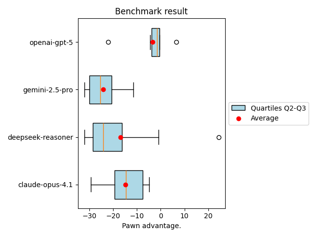

# LLM Reasoning Benchmark through Chess

This project is a benchmark designed to test the reasoning abilities of large language models (LLMs) using chess tasks.

---

## Why Chess?

Large language models such as **GPT-o4-mini** or **Gemini 2.5 Pro** still face significant challenges when playing chess. After the opening phase, which relies on known patterns, these models often make obvious mistakes—losing pieces without compensation or making illegal moves.

Chess is a particularly good test because:

- **Objective Evaluation**: The position on the board can be easily and objectively evaluated by a chess engine.
- **Demanding Tasks**: The benchmark is demanding and poses a real challenge for LLMs.

---

## How Does the Benchmark Work?

- The LLM plays a game against the **Stockfish engine** (with search depth limited to **1 ply**, i.e., depth=1), making Stockfish play rather weakly.
- This prevents the LLM from being immediately outclassed and allows meaningful differentiation between results.
- The game lasts 30 moves. After the opening phase, a chess engine evaluates the position after each move. At the end, an average is calculated.
- The first 5 moves are not counted, since the opening phase is mostly memorization rather than real reasoning.
- If the LLM wins, it gets the maximum score for all remaining moves
- If it loses or makes an illegal move, it gets the minimum score for the rest of the game.
- A tie results in a score of zero for all following moves
- Scoring uses the standard chess evaluation, ranging from +32 pawns (best) to -32 pawns (worst)
- The better the position achieved by the LLM, the stronger its reasoning and planning capabilities.

## Firsts Results

OpenAI models (openai-o4-mini, openai-o3) performed the best, staying closest to even positions (mostly). Gemini models achieved average results with higher variability. Claude models (opus-4 and sonnet-4) performed only average or poorly, and were by far the most expensive to use. Deepseek-reasoner delivered mixed results: in some games it played quite well, but in others it made very poor moves.

In summary, OpenAI models handled the task best, while Claude models, despite their high cost, did not meet expectations. Gemini and Deepseek was average, but cheap.

| Model             | Mean   | Median | Min    | Max    | 95% CI (mean)         | Total cost ($) |
|-------------------|--------|--------|--------|--------|----------------------|----------------|
| openai-o3         | -11.59 | -8.92  | -29.81 | -5.32  | [-20.00, -8.02]      | 4.71           |
| openai-o4-mini    | -16.37 | -14.79 | -26.93 | -6.56  | [-21.44, -11.61]     | 4.64           |
| claude-opus-4     | -25.35 | -23.62 | -32.00 | -20.78 | [-28.38, -23.20]     | 6.70           |
| gemini-2.5-pro    | -22.79 | -24.66 | -32.00 | -8.20  | [-27.27, -16.43]     | 2.12           |
| deepseek-reasoner | -23.68 | -25.44 | -32.00 | -9.79  | [-28.75, -17.71]     | 1.55           |
| claude-sonnet-4   | -23.61 | -25.78 | -32.00 | -12.20 | [-28.86, -17.90]     | 4.59           |
| gemini-2.5-flash  | -29.14 | -29.50 | -32.00 | -24.70 | [-30.34, -27.25]     | 0.49           |

---

## Roadmap

Planned next steps for the project include:

1. **Separation of Scoring from Game Data**  
   Refactor the code to split the scoring logic from the main game (party) data structures. This will allow for more advanced analyses and easier extension of evaluation methods.

2. **Cloud-Based Benchmarking**  
   Enable running the benchmark in the cloud, which will be especially useful for long-running analyses and experiments requiring more resources.

3. **Batch API Support**  
   Implement support for batch API operations, making it possible to submit and process multiple games or tasks simultaneously.

4. **Add Real Human Game Example**  
   Include an example of a real human-played game to provide a reference point for evaluation and to help compare LLM performance against actual human decisions.

5. **Implement More Chess Strategies for LLM**
   Expand the set of prompts used to interact with the LLM, allowing assessment of how different instructions or phrasings affect performance and reasoning in chess tasks.

